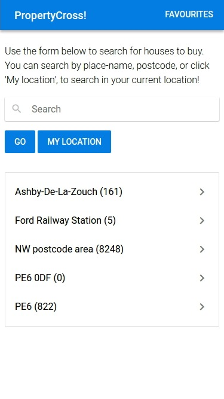
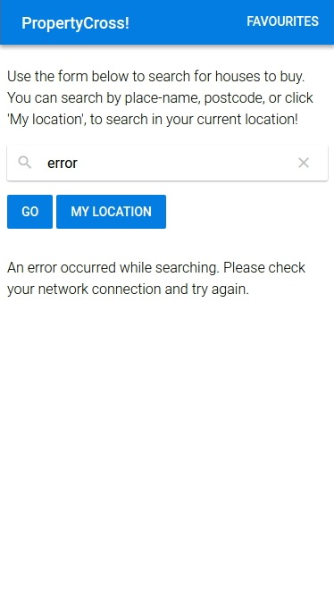
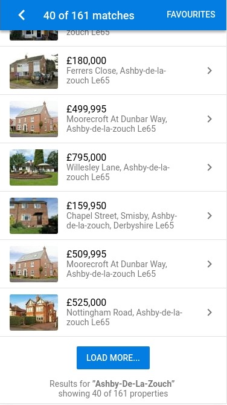
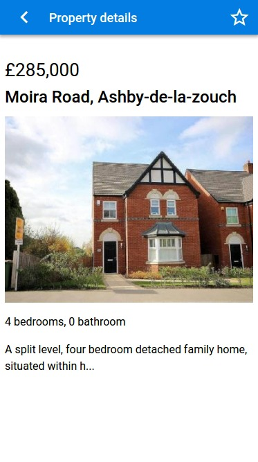
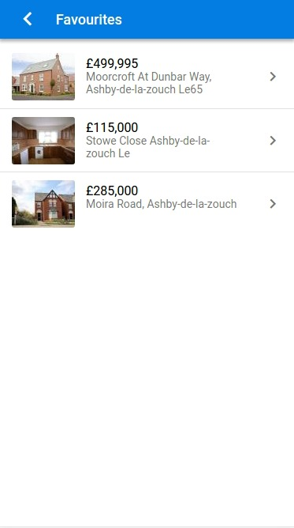
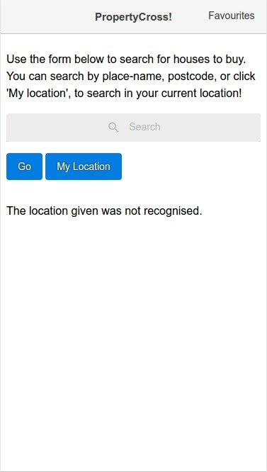
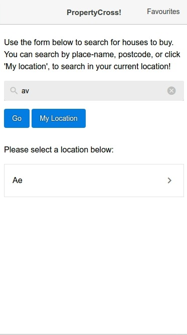
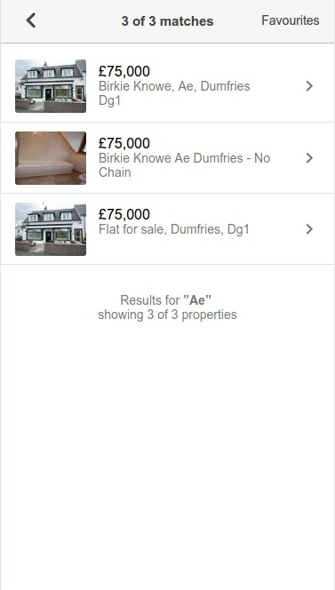
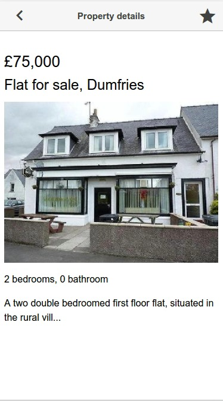
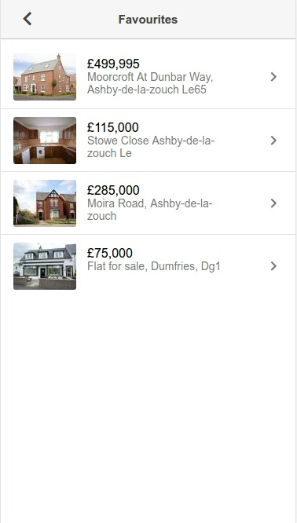

# Practical Task with VueJs 2 (Quasar Framework)

> A Quasar project for study VueJs 2

### Resources used in the development:

*  **Quasar Framework** - http://quasar-framework.org
*  **specification** - https://github.com/tastejs/PropertyCross/tree/master/specification


### Screenshots of the mobile application
<kbd></kbd>
<kbd></kbd>
<kbd></kbd>
<kbd></kbd>
<kbd></kbd>
<kbd></kbd>
<kbd></kbd>
<kbd></kbd>
<kbd></kbd>
<kbd></kbd>


## Build Setup

``` bash
# install dependencies
$ npm install

# serve with hot reload at localhost:8080
$ quasar dev

# build for production with minification
$ quasar build

```
